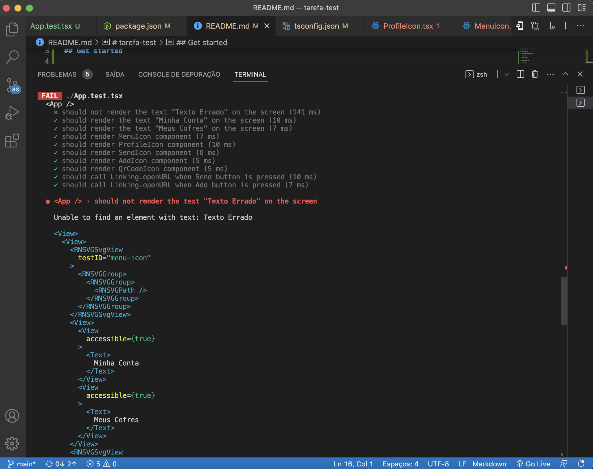
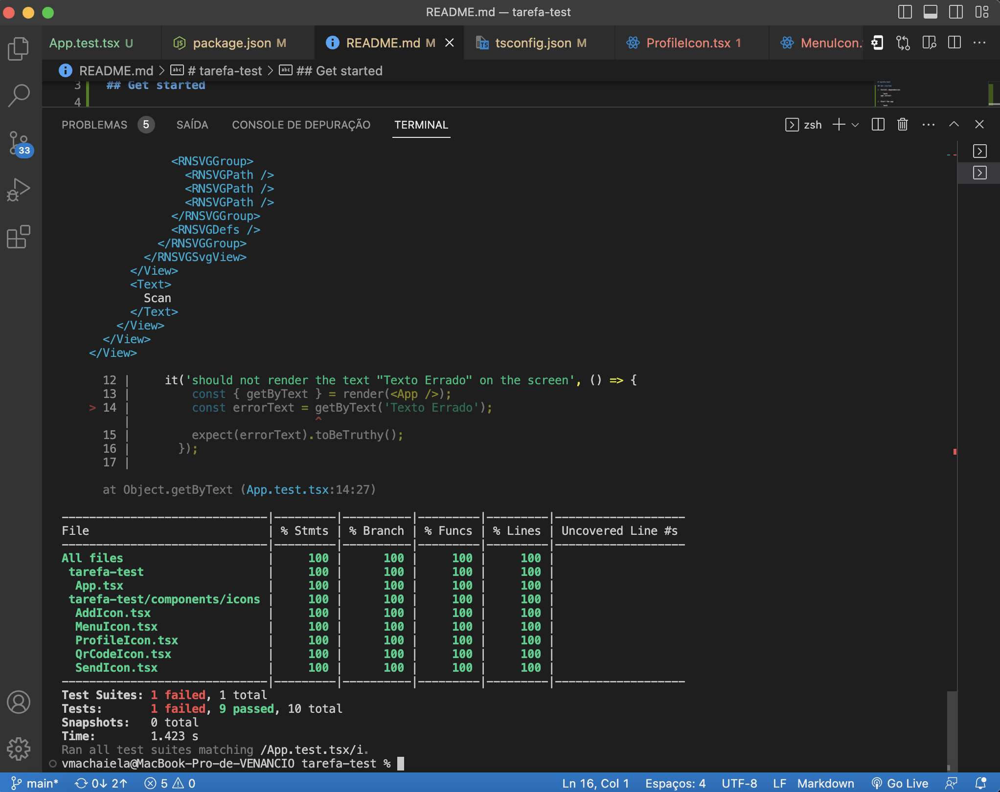

# Tarefa Teste

## Começando

1. Instalar dependências

   ```bash
   npm install
   ```

2. Executar a App

   ```bash
    npx expo start
   ```


## Relatório de Testes

### Testes Executados

Os testes foram executados utilizando o Jest e alguns testes falharam. 

### Testes de Componente `<App />`

#### Testes Passados:
- **✓** deve renderizar o texto "Minha Conta" na tela
- **✓** deve renderizar o texto "Meus Cofres" na tela 
- **✓** deve renderizar o componente MenuIcon
- **✓** deve renderizar o componente ProfileIcon
- **✓** deve renderizar o componente SendIcon 
- **✓** deve renderizar o componente AddIcon 
- **✓** deve renderizar o componente QrCodeIcon 
- **✓** deve chamar Linking.openURL quando o botão Enviar for pressionado 
- **✓** deve chamar Linking.openURL quando o botão Mais for pressionado 

#### Teste Falho:
- **✕** não deve renderizar o texto "Texto Errado" na tela







